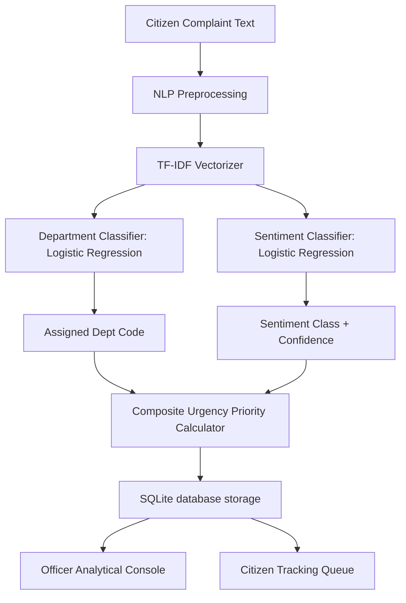

# Aegis AI — Government Grievance & Sentiment Triage Platform

[](https://www.python.org/)
[](https://fastapi.tiangolo.com/)
[](https://sqlite.org/)
[](https://scikit-learn.org/)

A production-grade Natural Language Processing (NLP) system designed to revolutionize public administration and citizen service delivery. Aegis AI automatically classifies citizen complaints, assigns them to appropriate government departments, calculates urgency priority based on sentiment analysis, and routes them to an interactive dashboard queue.

---

## 📺 Project Walkthrough & UI
The platform contains two distinct workspaces:
*   **Citizen Portal:** File grievances, get live ML prediction feedbacks (urgency dials, routing details), and track ticket statuses.
*   **Government Officer Console:** Review live workloads via dynamic Chart.js visualizations, search/filter tickets, and update resolution statuses and official logs.
*   **ML Research Portal:** Inspect model performance graphs, confusion matrices, and detailed F1-score evaluation metrics.

---

## 🏗️ System Architecture



---

## 🎯 Core Features
1.  **Multi-Class Department Routing:** Maps complex unstructured text into one of 18 official government departments (e.g., MINWR, DOURD, DOSAT) automatically.
2.  **Sentiment Triage Heuristics:** Computes an Urgency Priority Index (UPI) from 0.0 to 10.0 using model confidence score, sentiment class, and length parameters.
3.  **End-to-End Authentication:** Secure SQLite-backed user signup and token-session management.
4.  **Workload Visualizations:** Live bar charts and doughnut charts rendering category loading stats dynamically.
5.  **Model Performance Galleries:** Displays training dashboards, classification report tables, and confusion matrices directly.

---

## 📊 Machine Learning Model Performance

### Department Routing Classifier
*   **Model Type:** TF-IDF Vectorizer + Multi-class Logistic Regression
*   **Overall Accuracy:** `69.25%`
*   **Weighted F1-Score:** `68.00%`
*   **Output Classes:** 18 Departments (e.g., Water Resources, Road Transport, Sanitation)

### Sentiment Classifier
*   **Model Type:** TF-IDF Vectorizer + Logistic Regression
*   **Overall Accuracy:** `92.94%`
*   **Weighted F1-Score:** `91.76%`
*   **Classes:** Critical/Urgent | Negative | Neutral | Positive

---

## ⚙️ Tech Stack & Requirements
*   **Backend:** Python 3.8+, FastAPI, Uvicorn, SQLite
*   **Machine Learning:** Scikit-learn, joblib, NumPy, Pandas, NLTK
*   **Frontend:** Vanilla CSS, HTML5, JavaScript (SPA architecture), Chart.js CDN, FontAwesome CDN
*   **Dependencies:** Listed in `output/requirements.txt`

---

## 🚀 Installation & Setup

### 1. Clone the Repository
```bash
git clone https://github.com/saumyapatel792/Project-1-Government-Public-Sector---AI-Driven-Citizen-Grievance-Sentiment-Analysis-System.git
cd Project-1-Government-Public-Sector---AI-Driven-Citizen-Grievance-Sentiment-Analysis-System
```

### 2. Install Required Dependencies
Ensure you have Python installed, then run:
```bash
pip install -r output/requirements.txt
```

### 3. Launch the Application Server
Run the FastAPI development server:
```bash
python -m uvicorn app:app --host 127.0.0.1 --port 8000 --reload
```

### 4. Open the Interface
Navigate to **`http://127.0.0.1:8000/`** in your browser.

---

## 🔐 Seeding & Demo Access Credentials
For demo presentation purposes, the database is pre-seeded with sample grievances and accounts:
*   **Citizen Account:**
    *   **Username:** `citizen`
    *   **Password:** `citizen123`
*   **Government Officer Account:**
    *   **Username:** `officer`
    *   **Password:** `admin123`

You can also sign up with new custom credentials on the registration page.
